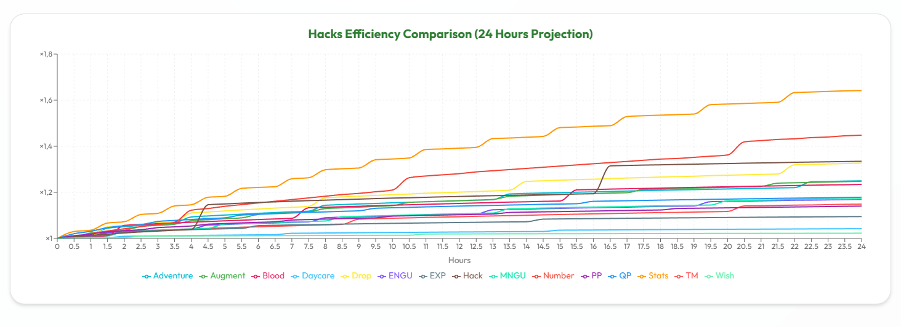

# Gear Optimizer - Material 3 Edition ✨

A modernized, high-performance fork of the original **Gear Optimizer** for NGU Idle. Redesigned with **Material 3 Expressive** aesthetics and powered by a lightning-fast React engine.

[](https://vitejs.dev/)
[](https://reactjs.org/)
[](https://mui.com/)

🔗 **[Live Demo (GitHub Pages)](https://postEntropy.github.io/gear-optimizer)**

---

## 🎨 Material 3 Revamp
We've completely overhauled the UI to align with Google's **Material 3 Expressive** design system.


*Modernized Home Page - featuring dynamic colors and glassmorphism elements.*

- **Dynamic Color Engine**: Choose your vibe with themes like **Forest (Default)**, Lime, Slate, Purple, and more.
- **Dark & Light Modes**: Fully supported with smooth transitions and optimized contrast.
- **Expressive Aesthetics**:
  - Rounded corners and elevated surfaces.
  - "Ghost Pill" navigation with sliding animations.
  - Custom "Starburst" loading indicators.

## ⚡ Performance Boost
Optimization isn't just about gear—it's about the app too.
- **Vite Powered**: Instant startup and hot reloading.
- **React Router v6**: Modern, declarative routing.
- **Debounced Saves**: No more input lag. State saving is handled asynchronously to keep the UI buttery smooth.
- **Code Splitting**: Heavy components load only when you need them (`React.lazy` & `Suspense`).
- **Memoized Computing**: Complex calculations are isolated to prevent unnecessary re-renders.

## 🚀 Key Features
### 🛒 Gear Optimization
- Calculate the mathematically perfect loadout for your current stats.
- Supports all factors: Power, Toughness, NGU Speed, Gold Drops, etc.

### 💹 Growth Efficiency & Highlights
A major feature of this fork is the integration of high-precision **Growth Efficiency** tools and visualization for advanced progression.


*NGU Progress Timeline - Visualizing projected levels and bonus gains at key milestones (1h, 12h, 24h).*

- **NGU Progress Timeline**:
  - **Milestone Navigation**: Toggleable rows (🕒 icon) reveal a comprehensive timeline showing projected levels (Normal, Evil, Sadistic) and percentage bonus gains.
  - **Dynamic Highlights**: The timeline automatically emphasizes your "Set Time" configuration, providing immediate feedback on rewards for your current rebirth plan.
  - **Game-Native Formatting**: All numbers (Million, Billion, Trillion, etc.) and level gains match the in-game experience perfectly.
- **Efficiency Highlighting**:
  - **Star Indicators (⭐)**: The system automatically calculates the efficiency across all active NGUs and Hacks, highlighting the upgrade with the best gain per resource with a star icon.
- **Cumulative Comparison**:
  - Section-wide charts at the bottom of Energy/Magic NGU and Hacks tables allow you to compare total growth between all available upgrades at a glance.


*Hacks Charting - Tracking progression and milestones with high-precision simulation.*

### 📜 History Tracking
Track your progress over time by importing "Rebirth Saves". This feature is designed to work with **[jshepler's NGU Mods](https://github.com/jshepler/jshepler.ngu.mods)**, which automatically generate saves named in the format `Rebirth_YYYY-MM-DD_HH-MM-SS.json`.


*Import your rebirth saves to build a comprehensive timeline of your progress using detailed charts for Energy, Magic, and Resource 3.*

- **Resource Visualization**: Detailed charts for **Energy**, **Magic**, and **Resource 3** (Power, Capacity, Bars).
- **Metric Tracking**: Monitor **Total Playtime**, **Arbitrary Points (AP)**, and other key stats across rebirths.
- **Save Management**: Automatically detects duplication to ensure clean history data.

### 🛠 UX Improvements
- **Advanced Modifiers**: Integrated seamlessly into the main dashboard (no more popups!).
- **Page Transitions**: Smooth fade and slide animations between tabs.
- **Context Preservation**: Refreshing the page keeps you exactly where you were.

---

## 💻 Running Locally

1.  **Clone the repo**
    ```bash
    git clone https://github.com/postEntropy/gear-optimizer.git
    cd gear-optimizer
    ```

2.  **Install dependencies**
    ```bash
    npm install
    # or
    yarn
    ```

3.  **Start the Dev Server**
    ```bash
    npm start
    ```

4.  **Build for Production**
    ```bash
    npm run build
    ```

---

## Credits
Based on the original [Gear Optimizer](https://github.com/gmiclotte/gear-optimizer) by **gmiclotte**.
Refactored and stylized by **postEntropy**.
