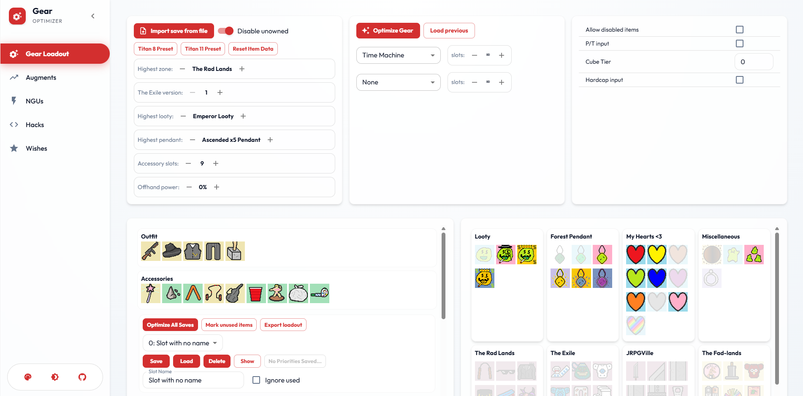
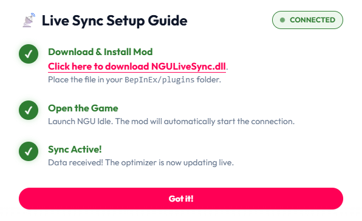
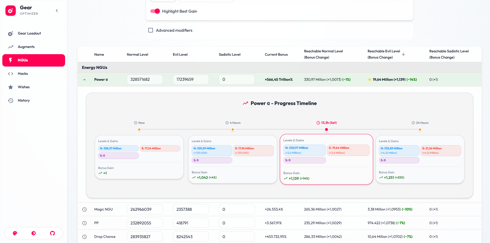
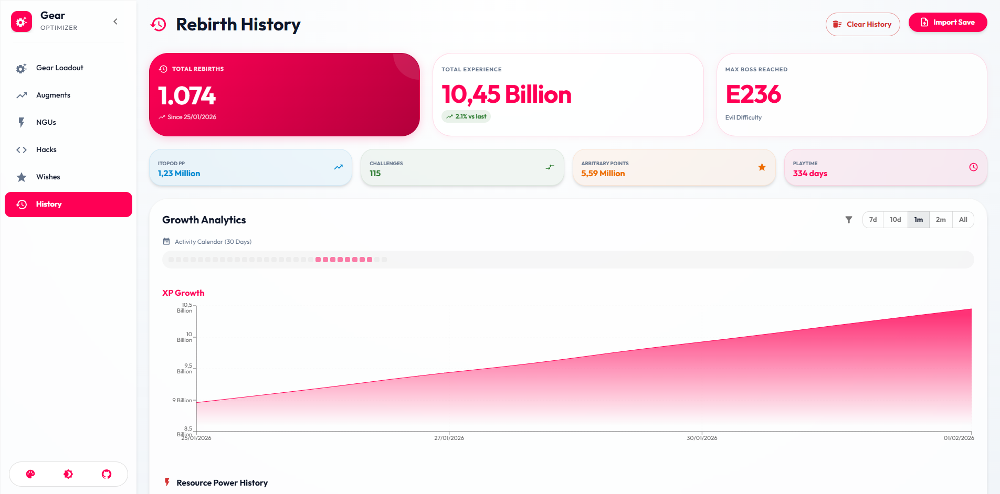

# Gear Optimizer - Material 3 Edition ✨

A modernized, high-performance fork of the original **Gear Optimizer** for NGU Idle. Redesigned with **Material 3 Expressive** aesthetics and powered by a lightning-fast React engine.

[](https://vitejs.dev/)
[](https://reactjs.org/)
[](https://mui.com/)

🔗 **[Live Demo (GitHub Pages)](https://postEntropy.github.io/gear-optimizer)**

---

## 🎨 Fresh Look, New Powers

*Experience NGU Idle optimization with a sleek, responsive Material 3 interface.*

### ✨ Highlights
- **Material 3 Design**: Dynamic colors, glassmorphism, and smooth animations.
- **Instant Performance**: Powered by Vite and React for zero-lag interactions.
- **Smart History**: Track your progress across rebirths with detailed charts.
- **Growth Analysis**: Visualize NGU and Hack efficiency with "best gain" highlighting.

---

## 📡 Live Sync (New!)
Stop manually exporting and importing saves! **Live Sync** connects the optimizer directly to your game.



### How to use:
1.  **Download the Mod**: [NGULiveSync.dll](https://github.com/postEntropy/gear-optimizer/raw/master/public/NGULiveSync.dll)
2.  **Install**: Place the `.dll` file into your `BepInEx/plugins` folder.
3.  **Launch**: Open NGU Idle. Use the **Live Sync** button in the optimizer to connect.
4.  **Enjoy**: Your stats, gear, and progress update automatically in real-time!

---

## 🚀 Features Deep Dive

### 🛒 Gear Optimization
Calculate the mathematically perfect loadout for your current stats, factoring in Power, Toughness, NGU Speed, Gold Drops, and more with high-precision math.

### 💹 Growth Efficiency

*Visualizing projected levels and bonus gains at key milestones (1h, 12h, 24h).*

- **Timeline Projections**: See exactly where your NGUs will be in the future.
- **Efficiency Stars (⭐)**: Automatically highlights the most efficient upgrade for your Energy/Magic.
- **Game-Native Formatting**: Numbers match the game format (1.23M, 4.56B) for easy reading.

### 📜 History Tracking

*Import rebirth saves to build a comprehensive timeline.*

- **Resource Visualization**: Detailed charts for **Energy**, **Magic**, and **Resource 3**.
- **Metric Tracking**: Monitor **Total Playtime**, **Arbitrary Points (AP)**, and more.
- **Auto-Detection**: Works perfectly with `jshepler.ngu.mods` auto-saves.

---

## 💻 Running Locally

```bash
# Clone
git clone https://github.com/postEntropy/gear-optimizer.git
cd gear-optimizer

# Install
npm install

# Start
npm start
```

## Credits
Based on the original [Gear Optimizer](https://github.com/gmiclotte/gear-optimizer) by **gmiclotte**.
Refactored and stylized by **postEntropy**.
